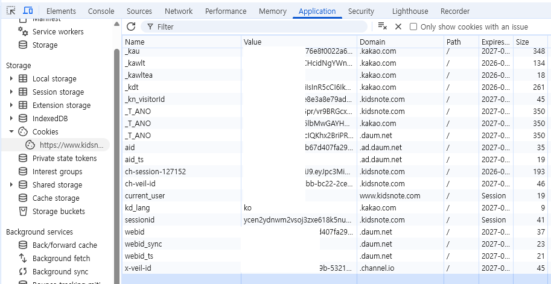

# 🍼 Kidsnote → Notion 자동 백업

> **어린이집 알림장과 사진을, 내 노션 DB에 영원히.**
> 졸업할 때 사라지지 않게.

[](LICENSE)
[](#8단계-백업-실행)
[](#)

키즈노트(어린이집 알림장 앱)에 매일 쌓이는 글·사진·동영상·첨부파일을 **나의 노션 데이터베이스로 자동 백업**하는 도구입니다.

- 컴퓨터를 켜둘 필요 없음 — GitHub의 클라우드 서버가 대신 실행
- 같은 알림장이 중복으로 들어가지 않음 — 매번 새것만 추가
- 사진의 위치(GPS) 정보는 업로드 전에 자동 제거
- **무료** — GitHub와 노션의 무료 플랜으로 충분

> ⚠️ **노션 무료 플랜의 5 MiB 파일 크기 제한**
> 노션 무료 플랜은 파일 1개당 5 MiB(약 5MB) 한도가 있습니다.
> - **사진**: 5MB 초과 시 자동으로 리사이즈·압축해서 업로드 (거의 100% 성공)
> - **동영상·첨부파일**: 5MB **미만**만 업로드. 그 이상은 자동으로 skip (해당 파일만 누락, 페이지는 정상 생성됨)
>
> 짧은 동영상이나 가벼운 PDF·엑셀은 그대로 들어가지만, 분량 큰 동영상은 노션에 안 올라갑니다. 노션 유료 플랜(파일당 5 GiB)을 쓰면 모두 업로드 가능합니다.

---

## 왜 이 도구가 필요한가요

키즈노트는 **졸업하면 접근이 끊깁니다**. 우리 아이의 매일이 담긴 사진과 선생님의 글이, 어느 날 갑자기 사라집니다.

내 노션 워크스페이스에 백업해두면:

- 🔍 **검색됩니다** — "토끼 점토놀이"로 검색해서 그날의 알림장을 1초 만에 찾아냄
- 📅 **정리됩니다** — 날짜순으로 자동 정렬, 1년치 모아보기 가능
- 🔒 **영원합니다** — 키즈노트가 사라지든 졸업하든 그대로 내 것
- 📸 **사진 원본 보존** — Kakao CDN에서 받은 원본 화질 그대로

---

## 무엇이 만들어지나요

노션 DB의 한 페이지 = 알림장 하나:

```
📅 5월 12일 알림장
   날짜: 2026-05-12
   Report ID: 1390908410

   오늘은 친구들과 함께 점토놀이를 했어요. 아이가 토끼를
   만들어 자랑스럽게 보여주었답니다. 점심도 잘 먹고...

   [📷 사진 5장 — EXIF GPS 자동 제거됨]
   [🎬 동영상 1개 (4.2 MB)]
   [📎 식단표.pdf (1.1 MB)]
```

1년치(보통 300개 안팎)가 노션 DB 한 곳에 모입니다. 사진은 자동 압축으로 거의 다 업로드되고, 동영상/첨부파일은 5MB 미만인 것만 들어갑니다.

---

## 어떻게 작동하나요

```
   내 키즈노트 계정
            │
            ▼
   GitHub Actions (클라우드 서버)    ← 컴퓨터 꺼져 있어도 OK
            │
            ▼
   사진 GPS 제거 → 5MB 초과시 자동 압축
            │
            ▼
   내 노션 DB                       ← 나만 접근 가능
```

데이터는 키즈노트 → GitHub의 임시 메모리 → 내 노션, 이렇게만 흐릅니다. 다른 서버에 저장되거나 노출되지 않습니다.

---

# 🚀 시작하기 (15분 ~ 20분)

## 준비물

시작 전에 다음을 준비하세요:

- [ ] **키즈노트 계정** — PC 브라우저(크롬/엣지/파이어폭스)에서 로그인 가능해야 합니다 (앱만 쓰는 분은 PC 웹사이트에서 한 번 로그인해 보세요)
- [ ] **노션 계정** (무료 OK) — 없으면 https://www.notion.so 에서 가입
- [ ] **GitHub 계정** — 없으면 https://github.com 에서 가입 (이메일만 있으면 1분)
- [ ] **Chrome 또는 엣지 브라우저** — 6단계에서 쿠키를 꺼낼 때 사용

> 💡 **소요 시간 안내**: 처음 셋업 15~20분. 그 이후 백업 한 번 돌리는 데는 알림장 분량에 따라 5분 ~ 4시간 (1년치 첫 백업이 가장 오래 걸림). 두 번째 이후는 새 알림장만 처리해서 보통 몇 분.

---

## 1단계. 이 프로젝트를 내 GitHub 계정으로 복사하기 (Fork)

"Fork(포크)"는 **남의 GitHub 프로젝트를 내 계정에 복사**한다는 뜻입니다. 원본은 그대로 두고, 내 사본에서 설정을 바꾸게 됩니다.

1. 이 페이지 상단으로 스크롤
2. 우측 상단 **검은색 `Fork` 버튼** 클릭 (Star 버튼 옆에 있음)
3. 다음 화면에서 옵션 그대로 두고 **녹색 `Create fork` 버튼** 클릭
4. 잠시 후 자동으로 **본인 계정의 사본 페이지**로 이동됨

✅ **성공 신호**: 페이지 좌측 상단에 `내깃허브아이디/kidsnote-backup` 로 표시 (원본은 `redchupa/kidsnote-backup`).

> ⚠️ Fork 단계에서 **"Copy the main branch only"** 체크가 기본으로 켜져 있어야 합니다 (이미 기본값). 그대로 두면 됩니다.

---

## 2단계. 노션에 백업용 데이터베이스 만들기

노션의 "데이터베이스"는 표 형태로 데이터를 저장하는 페이지입니다. 우리는 알림장 한 줄에 한 행씩 저장하는 표를 만들 거예요.

### 새 페이지 만들고 데이터베이스로 바꾸기

1. 노션 좌측 사이드바 하단의 **`+ 새 페이지`** 클릭
   - 노션 한글 UI: `+ 새 페이지`
   - 영문 UI: `+ New page`
2. 페이지가 열리면 상단의 제목 입력란에 **"키즈노트 백업"** 입력 (이름은 자유)
3. 본문 영역을 클릭해서 커서를 둔 다음, **반드시 영문 입력 모드**에서 `/database` 입력
   - ⚠️ 한글 입력 모드(한/영 키 확인!)에서 슬래시(`/`) 누르면 메뉴가 안 뜹니다
   - 슬래시를 누르면 즉시 메뉴가 팝업으로 떠야 합니다
4. 팝업 메뉴에서 **`데이터베이스 - 인라인`** 클릭 (영문: `Database - Inline`)
   - "데이터베이스 - 전체 페이지"가 아닙니다! "인라인"을 선택해야 같은 페이지 안에 표가 들어갑니다
5. DB 좌측 상단의 회색 "Untitled" 또는 "제목 없음" 클릭해서 **"키즈노트 백업"** 등 이름 입력

### 표의 컬럼(속성) 정리

새 데이터베이스는 기본으로 "이름", "태그" 두 컬럼이 보일 거예요. 이걸 정리해야 합니다:

6. **`태그`** 머리글 클릭 → 메뉴에서 **`속성 삭제`** (영문: `Delete property`) → 확인
7. 표 우측 끝의 **`+`** 아이콘 클릭 → 새 속성 추가:
   - **이름**: `날짜` (한글)
   - **종류**: `날짜` 선택 (영문: `Date`)
8. 다시 표 우측 끝 **`+`** 클릭 → 새 속성 추가:
   - **이름**: `Report ID` (정확히 영문, 대소문자 일치)
   - **종류**: `숫자` 선택 (영문: `Number`)

✅ **성공 신호**: 표 머리글에 **`이름` | `날짜` | `Report ID`** 세 컬럼이 보임. 행은 비어 있어도 OK.

> 💡 "이름" 컬럼이 영문 UI에서 `Name`으로 보이거나 한국어 UI지만 `이름`이 아닌 `제목` 등으로 보여도 괜찮습니다. 코드가 자동으로 인식합니다.

---

## 3단계. 노션 통합(Integration) 만들기 + 토큰 받기

노션 API를 사용하려면 "통합(Integration)"이라는 권한 토큰이 필요합니다. 이게 GitHub에서 노션 DB에 글을 쓸 수 있게 해주는 열쇠예요.

1. 새 탭에서 https://www.notion.so/profile/integrations 접속
   - 노션 로그인 상태여야 합니다
2. 페이지 우측 **`+ 새 통합`** (영문: `+ New integration`) 버튼 클릭
3. 폼 입력:
   - **이름**: `kidsnote-backup` (자유, 본인이 알아볼 수 있게)
   - **연결된 워크스페이스**: 본인 워크스페이스 선택 (자동 선택돼 있을 수 있음)
   - **유형**: `내부` (기본값 그대로)
4. 페이지 하단 **`저장`** (영문: `Save`) 클릭
5. 다음 화면에서 **`내부 통합 시크릿`** (영문: `Internal Integration Secret`) 항목 옆 **`표시`** 클릭 → **`복사`** 버튼

⚠️ 토큰을 **메모장에 잠깐 붙여두세요**. 5분 안에 GitHub에 등록할 예정입니다. 절대 다른 사람한테 공유하지 마세요.

토큰 모양 예시:
- 새 형식: `ntn_AbCdEfGh1234...` (50자 정도)
- 이전 형식: `secret_AbCdEfGh1234...` (50자 정도)

✅ **성공 신호**: 클립보드에 50자 정도의 영문+숫자 문자열이 있음.

---

## 4단계. 노션 DB에 통합 연결하기

토큰을 만들었다고 끝이 아닙니다. 이 통합이 우리 DB에 글을 쓸 수 있도록 **명시적으로 연결**해야 합니다 (안 하면 다음에 "권한 없음" 에러).

1. 2단계에서 만든 **DB 페이지로 돌아가기**
2. 페이지 **우측 상단의 `⋯`** (점 세 개 아이콘) 클릭
3. 드롭다운 메뉴 하단 **`연결`** (영문: `Connections`) 클릭
4. 펼쳐진 메뉴에서 **`연결 검색`** 입력란 클릭
5. **`kidsnote-backup`** (3단계에서 만든 이름) 입력 → 검색 결과에서 클릭
6. "이 페이지에 액세스 권한을 허용하시겠습니까?" 같은 확인 팝업이 뜨면 **`확인`** (또는 `허용`)

✅ **성공 신호**: 다시 `⋯` → `연결`에 들어가면 **`kidsnote-backup`** 이름이 목록에 표시됨.

> ⚠️ 만약 `kidsnote-backup`이 검색돼도 안 나타나면: 3단계에서 `저장` 안 됐거나, 다른 워크스페이스에 만들었거나, 이름 오타. 3단계 다시 확인.

---

## 5단계. 노션 DB ID 복사하기

DB ID는 노션 URL 안에 들어있는 32자 영문+숫자 문자열입니다.

DB 페이지가 열려 있는 상태에서 **브라우저 주소창 URL**을 확인하세요:

### 예시 URL 패턴

**워크스페이스 이름이 URL에 포함된 경우:**
```
https://www.notion.so/redchupa/238f5e29c0894adfb6c4d8e1a5b2c3d4?v=abcdef1234567890
                      ────────  ────────────────────────────────  
                      워크스페이스    이 32자가 DB ID
```

**워크스페이스가 없는 경우 (개인 계정):**
```
https://www.notion.so/238f5e29c0894adfb6c4d8e1a5b2c3d4?v=abcdef1234567890
                      ────────────────────────────────
                      이 32자가 DB ID
```

### 규칙

- 마지막 슬래시(`/`) 다음부터 **물음표(`?`) 이전까지**
- 보통 **32자**, 영문 소문자 + 숫자 조합 (간혹 하이픈 포함)
- DB 이름 한글 부분이 URL에 있으면 그건 무시하고 hex 부분만

⚠️ DB ID를 **메모장에 붙여두세요** (다음 단계에서 GitHub에 등록).

✅ **성공 신호**: 메모장에 32자 hex 문자열 있음.

> 💡 URL이 너무 길어서 32자가 안 보이면 페이지 우측 상단 `공유` → `링크 복사`로 정확한 URL을 받은 다음 위 규칙 적용.

---

## 6단계. 키즈노트 sessionid 쿠키 가져오기 (Chrome 기준)

여기가 가장 어려워 보이지만 차근차근 따라하면 30초 안에 끝납니다.

> Chrome 외에도 엣지(같은 화면) / 파이어폭스(`F12` → `저장소`)에서도 가능합니다. 아래는 Chrome 기준.

### 단계

1. **Chrome**으로 https://www.kidsnote.com 접속 → 평소처럼 로그인
2. 로그인된 상태에서 키보드 **`F12`** 키 누르기 → 우측에 개발자 도구 창이 열림
3. 개발자 도구 상단 메뉴에서 **`Application`** 클릭
   - 한국어 Chrome도 메뉴는 영문 그대로 (`Elements`, `Console`, `Sources`, `Network`, ... 옆에 있음)
   - 안 보이면 `>>` 아이콘 클릭해서 더 보기에서 `Application` 선택
4. 왼쪽 사이드바에서 **`Storage`** 섹션 아래 **`Cookies`** 폴더 펼치기 → **`https://www.kidsnote.com`** 클릭
5. 오른쪽에 큰 표가 나타남. 컬럼 헤더: `Name | Value | Domain | Path | Expires | Size | ...`
6. 표에서 **다음 두 조건을 모두 만족하는 행** 찾기:
   - **`Name` 컬럼**이 정확히 **`sessionid`** (다른 비슷한 이름은 무시 — 아래 표 참고)
   - **`Domain` 컬럼**이 **`.kidsnote.com`** (앞에 점이 있음)
7. 그 행의 **`Value` 컬럼** 셀 클릭 → 우측 패널 또는 표 안에 풀텍스트 표시됨 → 더블클릭으로 전체 선택 → `Ctrl+C` 복사



쿠키 값 예시: `ycen2ydnwm2vsoj3zxe618k5nugt7j33` (영문 소문자 + 숫자 32자 정도)

⚠️ 메모장에 붙여두세요.

### 🚫 헷갈리지 마세요 — 절대 복사하면 안 되는 쿠키들

쿠키 표를 보면 `sessionid`처럼 보이는 이름이 여럿 있을 거예요. 다음은 **전부 다른 용도**이므로 무시하세요:

| 쿠키 이름 | 정체 |
|---|---|
| `_kau`, `_kawlt`, `_kdt`, `_karb`, `_kasl` 등 `_k*` | Domain이 `.kakao.com` — 카카오 로그인/광고용 |
| `ch-session-127152`, `ch-veil-id` | 채널톡(홈페이지 우측 하단 챗봇) 세션 |
| `current_user` | 사용자 ID 표시용 (값이 짧음, sessionid 아님) |
| `_kn_visitorId`, `_gcl_au`, `_ga*`, `_dd_s` | 방문자 통계용 |

**정답은 단 하나**: `Name`이 정확히 **`sessionid`** + `Domain`이 정확히 **`.kidsnote.com`** 인 행.

> 💡 **쿠키 만료 안내**: 이 sessionid는 약 **30일 후 만료**됩니다. 만료 후 워크플로를 실행하면 에러가 나는데, 그때는 **이 6단계 + 7단계만 다시** 하면 됩니다 (사진 가이드 한 페이지만 참고).

✅ **성공 신호**: 메모장에 32자 정도의 영문+숫자 문자열이 있음.

---

## 7단계. GitHub에 3개 비밀 값 등록하기

이제 메모장에 모은 세 값을 GitHub fork에 안전하게 저장합니다. GitHub Secrets는 암호화되어 저장되며, 워크플로 실행 시에만 사용됩니다.

1. 1단계에서 만든 **내 fork** 페이지로 이동 (`https://github.com/내깃허브아이디/kidsnote-backup`)
2. 상단 메뉴에서 **`Settings`** (톱니바퀴 아이콘) 클릭
   - ⚠️ 헷갈리는 부분: 페이지 우측 상단에 본인 프로필의 `Settings`도 있는데, **그건 GitHub 전체 설정**입니다. 우리는 **repo의 Settings** (페이지 가운데 메뉴 줄에 있는 것)를 클릭해야 합니다
3. 좌측 사이드바에서 **`Secrets and variables`** 펼치기 → **`Actions`** 클릭
4. 페이지 우측 상단 **녹색 `New repository secret` 버튼** 클릭
5. 다음 표대로 3번 반복해서 등록:

| Name (정확히 일치, 대소문자 구분) | Secret 값 |
|---|---|
| `NOTION_TOKEN` | 3단계에서 받은 토큰 (`ntn_...` 또는 `secret_...`) |
| `NOTION_DATABASE_ID` | 5단계에서 추출한 32자 hex |
| `KIDSNOTE_SESSION_COOKIE` | 6단계에서 복사한 쿠키 값 |

매번 클릭 흐름:
1. `New repository secret` 클릭
2. `Name` 칸에 시크릿 이름 입력 (위 표 그대로)
3. `Secret` 칸에 값 붙여넣기
4. 녹색 `Add secret` 버튼 클릭
5. 다음 시크릿으로 반복

> ⚠️ **이름 오타에 주의**: `NOTION_TOKEN`이 아닌 `NOTION-TOKEN`, `Notion_Token` 등으로 입력하면 워크플로가 못 찾습니다. **반드시 대문자 + 언더바**.

> ⚠️ 값 복사할 때 **앞뒤 공백/줄바꿈이 포함되지 않게** 주의. 메모장 → GitHub 붙여넣기 시 가급적 깔끔하게.

✅ **성공 신호**: 시크릿 목록에 `NOTION_TOKEN`, `NOTION_DATABASE_ID`, `KIDSNOTE_SESSION_COOKIE` **3개**가 나열됨. 값은 `***` 으로 가려지고 등록 시간만 표시됨.

---

## 8단계. 백업 실행!

드디어 마지막 단계. 워크플로를 직접 한 번 돌려서 백업을 시작합니다.

1. fork repo 페이지 상단 메뉴에서 **`Actions`** 탭 클릭
2. **처음이라면** 화면 가운데에 노란 안내가 뜹니다:
   > Workflows aren't running on this fork. The maintainer can enable them.
   - 녹색 **`I understand my workflows, go ahead and enable them`** 버튼 클릭
3. 좌측 워크플로 목록에서 **`Kidsnote → Notion mirror`** 클릭
4. 가운데 영역 우측 상단의 **회색 `Run workflow ▾`** 드롭다운 클릭
5. 작은 폼이 펼쳐짐:
   - `Branch`: `main` (그대로 둠)
   - `limit`: **비워둠** (전체 백업) 또는 처음 테스트라면 `3` 입력
6. 폼 하단 **녹색 `Run workflow` 버튼** 클릭

### 진행 상황 보기

워크플로가 시작되면 좌측에 노란색 동그라미와 함께 새 run이 나타납니다. 클릭해서 들어가면:

1. **`mirror`** 작업(job) 클릭
2. **`Mirror Kidsnote → Notion`** 스텝의 화살표를 펼치면 실시간 로그가 한 줄씩 출력됨:

```
Notion DB: 0 existing report pages will be skipped
fetched 342 reports for child id=5000421
Notion mirror: 342 total fetched, 0 already in DB (skip), 342 to publish
Progress   0.3% (1/342) | Notion +1 rid=1390908410
Progress   0.6% (2/342) | Notion +1 rid=1390273292 img=5/5
Progress   1.5% (5/342) | Notion +1 rid=1389456123 img=8/8 vid=1/1
Progress   2.0% (7/342) | Notion +1 rid=1388112345 img=3/3 file=1/1
...
Progress 100.0% (342/342) | Notion +1 rid=1182164750 img=2/2
Notion mirror DONE: 342 new pages, 0 already existed, 0 failed
```

로그 표기:
- `img=N/M`: 사진 N개 업로드 성공 / M개 시도 (skip 또는 실패 = `M-N`)
- `vid=N/M`: 동영상 (5MB 미만만 업로드)
- `file=N/M`: 첨부파일 PDF/엑셀 등 (5MB 미만만 업로드)
- 첨부물이 없으면 해당 항목 생략

### 예상 소요 시간

| 알림장 개수 | 사진 평균 | 예상 시간 |
|---|---|---|
| ~50개 | 적음 | 5~10분 |
| ~150개 | 보통 | 20~40분 |
| ~300개 (1년치) | 많음 (사진 20장+ 알림장 다수) | 1~3시간 |

워크플로 timeout은 **6시간**까지 허용돼 있어 1년치 초기 백업도 한 번에 끝납니다.

### 만약 중간에 멈추면?

GitHub Actions는 종종 네트워크 이슈 등으로 중간에 멈출 수 있어요. 걱정 마세요:

- **이미 만들어진 노션 페이지는 그대로 유지**됩니다
- 8단계만 다시 실행하면 **이어서** 백업됩니다 (dedup이 기존 페이지 자동 skip)

✅ **최종 성공 신호**:
- Actions 페이지에서 워크플로 옆 동그라미가 **녹색 체크 ✅** + `succeeded`
- 노션 DB로 돌아가서 보면 알림장들이 날짜순으로 들어가 있음
- 페이지 클릭하면 본문 + 사진 정상 표시
- 사진 클릭하면 원본 화질로 열림

---

# 🔄 두 번째 이후 백업

처음 셋업이 끝나면, 이후 백업은 정말 간단합니다.

키즈노트에 새 알림장이 쌓이면:

1. fork repo의 **`Actions`** 탭 → **`Kidsnote → Notion mirror`** → **`Run workflow`** → 녹색 버튼
2. 5분 정도 기다림 (새 알림장만 처리, dedup이 나머지 자동 skip)
3. 끝!

### 쿠키 만료 시 (약 30일마다)

워크플로 실행했는데 에러(`401` 또는 `Notion DB query failed: ...`)가 나오면, 쿠키가 만료됐다는 신호입니다.

해결법:
1. **6단계** 다시 실행 (새 sessionid 추출)
2. **GitHub Secrets**에서 `KIDSNOTE_SESSION_COOKIE` 클릭 → `Update secret` → 새 값 붙여넣기 → `Update`
3. 다시 워크플로 실행

전체 2분이면 끝납니다.

---

# 💡 자주 묻는 질문

### 비용은 정말 안 드나요?

네, **0원**입니다.

- **GitHub Actions**: public repo는 무제한 무료. private fork도 월 2,000분 무료 (1년치 백업 30분 + 매주 5분 추가 = 월 35분 안팎이라 절대 안 넘침)
- **노션**: 무료 플랜으로 충분 (1년치 알림장 + 사진이 1~3 GB 정도, 노션 무료 한도 안)

### 자녀가 둘 이상이면?

기본은 가장 먼저 등록된 자녀의 알림장이 백업됩니다.

다른 자녀를 백업하려면:
1. 처음 한 번 워크플로 실행 → Actions 로그에서 `fetched N reports for child id=12345` 확인
2. fork의 `.github/workflows/kidsnote-to-notion.yml` 파일 편집 → `ARGS=( ... )` 줄에 `--child-id 자녀id숫자` 추가
3. 별도 노션 DB를 만들고 (자녀별로 분리) `NOTION_DATABASE_ID` 시크릿을 그쪽으로 변경

자녀별로 별도 fork를 만드는 게 더 깔끔할 수 있습니다.

### 같은 알림장이 중복으로 백업되지 않나요?

**중복 안 됩니다.** 매번 백업 실행할 때 코드가 먼저 노션 DB를 한 번 훑어서 이미 들어 있는 알림장의 **Report ID**(키즈노트 내부 고유번호)를 전부 모은 다음, 그 목록에 없는 것만 새로 추가합니다.

그래서 다음과 같이 마음 편하게 사용 가능:
- **하루 한 번 실행해도, 일주일에 한 번 실행해도 OK** — 누락 없이 새것만 들어감
- **테스트로 여러 번 돌려도 OK** — 두 번째부터는 새 알림장만 처리 (보통 몇 초)
- **이전 백업이 도중에 멈춰도 OK** — 다시 실행하면 끊긴 지점부터 자연스럽게 이어짐

로그에서 다음과 같이 확인할 수 있어요:
```
Notion mirror: 350 total fetched, 342 already in DB (skip), 8 to publish
Progress  12.5% (1/8) | Notion +1 rid=1392456789 img=5/5
...
```

`already in DB (skip)` 숫자가 = 이미 백업된 것, `to publish` = 새로 추가될 것.

### 사진이 너무 큰데 괜찮나요?

노션 무료 플랜은 파일당 5 MiB(약 5MB) 한도입니다. **사진**의 경우 코드가 자동으로:

1. EXIF 위치(GPS) 정보 제거
2. 1920px로 리사이즈
3. JPEG 품질 단계적 축소 (85 → 60)

키즈노트의 일반 iPhone/Android 사진(3~8MB)은 100% 통과합니다.

### 동영상이나 PDF·엑셀 같은 첨부파일도 백업되나요?

**5MB 미만**인 동영상과 첨부파일은 노션 페이지에 그대로 업로드됩니다. 5MB 이상은 노션 무료 플랜의 파일 크기 한도 때문에 **자동 skip**됩니다 (해당 파일만 누락, 알림장 본문과 다른 첨부물은 정상 처리).

| 첨부 종류 | 5MB 미만 | 5MB 이상 |
|---|---|---|
| 📷 사진 | ✅ 그대로 업로드 | ✅ 자동 압축 후 업로드 |
| 🎬 동영상 | ✅ 그대로 업로드 (`동영상` 섹션) | ⚠️ skip (페이지에 표시 안 됨) |
| 📎 PDF·엑셀 등 | ✅ 그대로 업로드 (`첨부 파일` 섹션) | ⚠️ skip |

워크플로 로그에서 skip된 게 있으면 다음과 같이 표시됩니다:
```
WARNING video 5월_운동회.mp4 is 12340567 bytes > 5000000 cap; skipping (Notion free tier limit)
```

**노션 유료 플랜**(Plus 이상)을 쓰면 파일당 5 GiB까지 가능해서 모두 업로드 가능합니다. 다만 무료 플랜으로도 본문 텍스트 + 사진은 손실 없이 다 저장되니, 영상 분량이 많은 경우만 유료 검토하면 됩니다.

### 카카오 SSO(카카오 로그인) 계정도 되나요?

네, 됩니다. 쿠키 기반이라 카카오 SSO든 일반 계정이든 차이가 없습니다. 브라우저에서 평소처럼 로그인만 되면 OK.

### 매주 자동으로 실행되게는 못 하나요?

**아쉽게도 안 됩니다.** 키즈노트의 로그인 페이지가 SPA(JavaScript 기반)로 바뀐 후, 자동 로그인을 위한 안정적 방법이 없어졌습니다. sessionid 쿠키를 수동으로 갱신해야 해서 **수동 실행만 가능**합니다.

다행히 한 번 셋업하면:
- 매주 일요일에 한 번씩 5초만 투자해서 워크플로 실행 (한 번 클릭)
- 한 달에 한 번 쿠키 갱신 (3분)

이 정도 손이 듭니다.

### 내 데이터가 안전한가요?

- 모든 비밀값은 **GitHub Secrets**로 암호화 저장 (코드 어디에도 평문 등장 X)
- 알림장과 사진은 **GitHub Actions의 임시 메모리 → 내 노션** 으로만 흐르고, 다른 곳에 저장되지 않습니다
- 워크플로 실행이 끝나면 GitHub 측 임시 데이터는 즉시 삭제됩니다
- **위치 정보(GPS)는 노션 업로드 전에 제거**되므로 노션 측에도 위치 흔적 남지 않음
- 코드 전체가 **MIT 라이선스** 오픈소스 — fork한 본인이 직접 검토 가능 (Python 약 500줄)

### 워크플로가 실패했어요. 어떻게 디버깅하나요?

**Actions 탭 → 실패한 run 클릭 → 빨간 X 표시 옆 스텝 클릭 → 로그 확인**.

흔한 에러:

| 에러 메시지 | 원인 | 해결 |
|---|---|---|
| `KIDSNOTE_SESSION_COOKIE missing` | 시크릿 이름 오타 | 7단계 시크릿 이름 확인 |
| `401 Unauthorized` 또는 비슷한 키즈노트 에러 | sessionid 만료 (약 30일) | 6단계 다시, Update Secret |
| `Notion DB query failed: 'latin-1'...` | 토큰에 BOM 같은 이상한 문자 끼임 | 토큰 시크릿 다시 등록 (가능하면 직접 타이핑하지 말고 복사 붙여넣기) |
| `Notion DB query failed: ... 404` | 4단계 통합 연결 안 됨, 또는 DB ID 오타 | 4단계와 5단계 다시 확인 |
| `Database not connected to integration` | 4단계 빠뜨림 | 4단계 진행 |

### 노션 한국어 UI랑 다른데요?

UI는 노션이 가끔 바뀝니다. 메뉴 이름이 달라도 다음 기능을 찾으면 됩니다:

- "데이터베이스 만들기" — 페이지 본문에서 `/database` (반드시 영문 입력)
- "통합 만들기" — https://www.notion.so/profile/integrations 직접 접속
- "DB에 통합 연결" — DB 페이지 우측 상단 `⋯` 메뉴 → 연결/Connections
- "속성 추가" — DB 표 우측 끝 `+` 아이콘

---

# 🛠️ 기술 스택 (개발자용)

- Python 3.12 + `requests` + `Pillow` + `piexif`
- GitHub Actions (ubuntu-latest)
- Notion API v2022-06-28 (file_uploads + databases)
- 키즈노트 비공식 API `/api/v1_2/children/<id>/reports/`

핵심 코드는 [`tools/kidsnote_fetch/`](tools/kidsnote_fetch/) (약 500줄):
- `fetch.py` — 키즈노트 API 호출 + 메인 로직
- `notion_mirror.py` — 노션 DB 쓰기 + 이미지 압축 + EXIF strip
- `requirements.txt` — Python 의존성

워크플로 정의: [`.github/workflows/kidsnote-to-notion.yml`](.github/workflows/kidsnote-to-notion.yml)

---

# ☕ 후원

이 도구가 가족 추억을 지키는 데 도움이 됐다면, 커피 한 잔으로 응원해 주세요. 🙏

<table>
  <tr>
    <td align="center">
      <b>토스</b><br/>
      
    </td>
    <td align="center">
      <b>PayPal</b><br/>
      
    </td>
  </tr>
</table>

- 토스/카카오뱅크: **1000-1261-7813** (우*만) · *커피 한잔은 사랑입니다*

후원과 기능은 별개입니다 — 모든 코드는 MIT 라이선스로 누구나 자유롭게 쓸 수 있습니다.

---

# 📄 라이선스

[MIT](LICENSE). 자유롭게 fork·수정·재배포 가능.

단, **본인 fork에는 자녀 개인정보가 GitHub Actions 로그를 통해 노출될 가능성이 있으니** 일반적으로 fork는 그대로 두고 백업만 돌리세요. 코드 수정 후 다른 사람에게 공개할 때는 자신의 데이터가 안 묻어 있는지 한 번 더 확인해 주세요.
